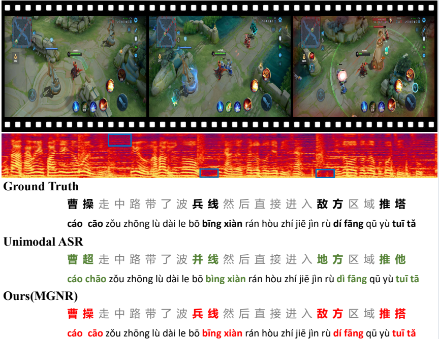
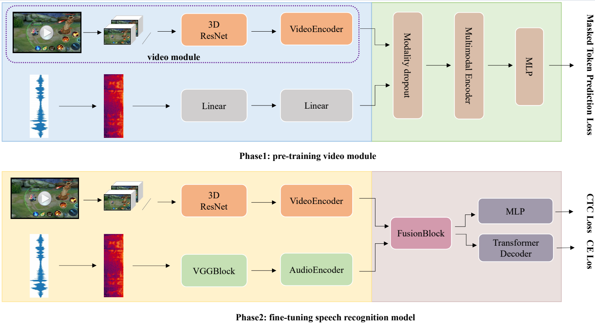

# MGNR: Multimodal Game Narration Recognition by Integrating Game Videos and Narration Speech

# Content

  ## Introduction
  This is the respository of Multimodal Game Narration Speech Recognition. In this repository, we provide pre-training code, network settings for end-to-end visual speech recognition. We trained our model on GND. 
  

  
  

  ## Framework
  The architecture of multimodal game narration recognition (MGNR) for speech recognition. We set have two phrase, 
  phrase 1 is pre-trained video module by masked token prediction loss. 
  phrase 2 fine-tune the pre-trained unimodal speech recognition model by combing video module in phrase 1.
  

  
  

We release game narrative datasets (GND) soon......
